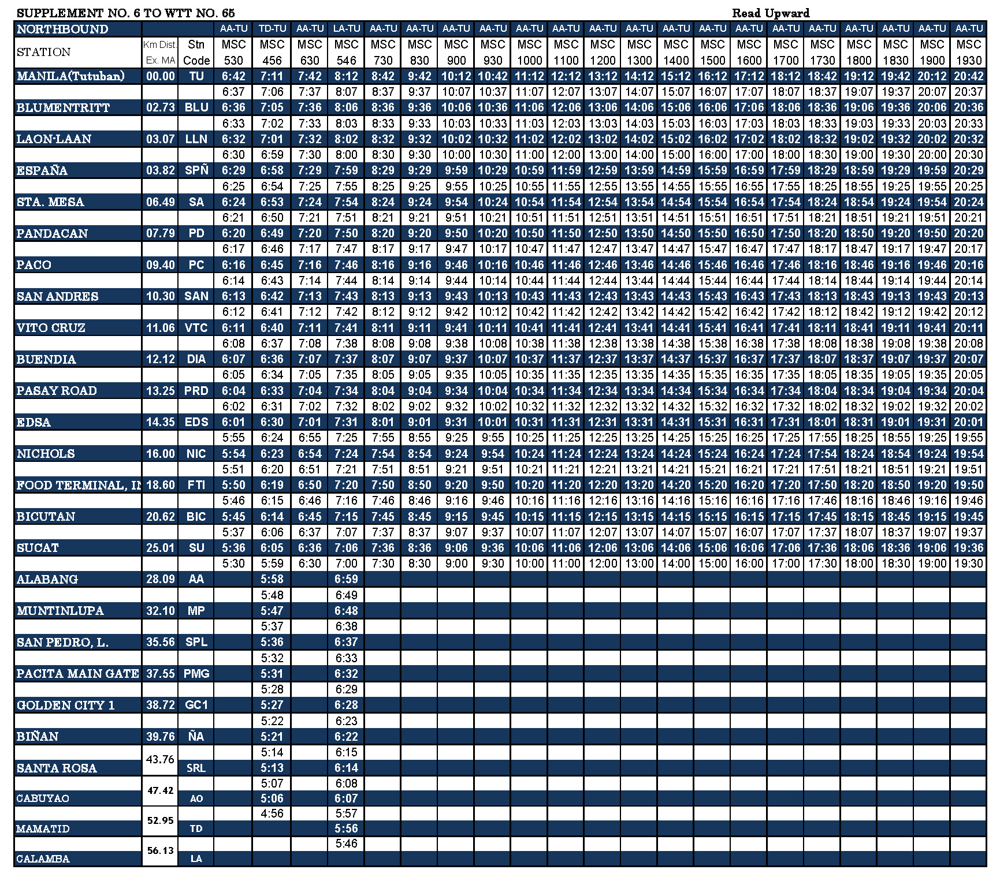

# Philippine National Railways GTFS data

This project generates a [GTFS][1] feed for the [PNR][2]. This is current as of
July 30, 2018.

## Sources

 * route description - [Wikipedia][3]
 * timetable - PNR [northbound][4] and [southbound][5] (last updated July 2018, data as of Aug 2017)
   * 
   * 
 * fares - [PNR][6]
 * stops - [OpenStreetMap][7]
 * shapes - [OpenStreetMap][7]

[1]: http://gtfs.org
[2]: http://pnr.gov.ph
[3]: https://en.wikipedia.org/wiki/PNR_Metro_South_Commuter_Line
[4]: http://www.pnr.gov.ph/images/Timetable/nb081517.jpg
[5]: http://www.pnr.gov.ph/images/Timetable/sb081517.jpg
[6]: http://pnr.gov.ph/images/banners/fare_increase_aircon.jpg
[7]: https://www.openstreetmap.org/relation/660480
